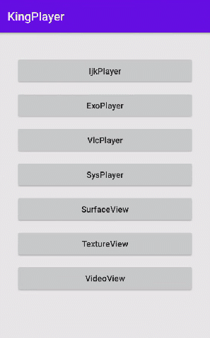

# KingPlayer

[](https://raw.githubusercontent.com/jenly1314/KingPlayer/master/app/release/app-release.apk)
[](https://bintray.com/beta/#/jenly/maven/king-player)
[](https://jitpack.io/#jenly1314/KingPlayer)
[](https://travis-ci.org/jenly1314/KingPlayer)
[](https://circleci.com/gh/jenly1314/KingPlayer)
[](https://android-arsenal.com/api?level=21)
[](https://opensource.org/licenses/mit-license.php)

KingPlayer 一个专注于 Android 视频播放器（IjkPlayer、ExoPlayer、VlcPlayer、SysPlayer）的基础库，无缝切换内核。


## 功能说明
- [x] 主要播放相关核心功能
- [x] 播放器无缝切换
  - [x] MediaPlayer封装实现（SysPlayer）
  - [x] IjkPlayer封装实现
  - [x] ExoPlayer封装实现
  - [x] vlc-android封装实现
- [ ] 控制图层相关
  - [ ] 待补充...

## Gif 展示


> 你也可以直接下载 [演示App](https://raw.githubusercontent.com/jenly1314/KingPlayer/master/app/release/app-release.apk) 体验效果

## 引入

### Gradle:

1. 在Project的 **build.gradle** 或 **setting.gradle** 中添加远程仓库

	```gradle
	repositories {
	  //...
	  mavenCentral()
	}
	```

2. 在Module的 **build.gradle** 里面添加引入依赖项

	使用 **SysPlayer** (Android自带的MediaPlayer)
	```gradle
	//KingPlayer基础库，内置SysPlayer
	implementation 'com.github.jenly1314.KingPlayer:king-player:1.0.0-beta1'
	```

	使用 **IjkPlayer**
	```gradle
	//KingPlayer基础库（必须）
	implementation 'com.github.jenly1314.KingPlayer:king-player:1.0.0-beta1'
	//IjkPlayer
	implementation 'com.github.jenly1314.KingPlayer:ijk-player:1.0.0-beta1'

	// 根据您的需求选择ijk模式的so
	implementation 'tv.danmaku.ijk.media:ijkplayer-armv7a:0.8.8'
	// Other ABIs: optional
	implementation 'tv.danmaku.ijk.media:ijkplayer-armv5:0.8.8'
	implementation 'tv.danmaku.ijk.media:ijkplayer-arm64:0.8.8'
	implementation 'tv.danmaku.ijk.media:ijkplayer-x86:0.8.8'
	implementation 'tv.danmaku.ijk.media:ijkplayer-x86_64:0.8.8'

	```

	使用 **ExoPlayer**
	```gradle
	//KingPlayer基础库（必须）
	implementation 'com.github.jenly1314.KingPlayer:king-player:1.0.0-beta1'
	//ExoPlayer
	implementation 'com.github.jenly1314.KingPlayer:exo-player:1.0.0-beta1'
	```

	使用 **VlcPlayer**
	```gradle
	//KingPlayer基础库（必须）
	implementation 'com.github.jenly1314.KingPlayer:king-player:1.0.0-beta1'
	//VlcPlayer
	implementation 'com.github.jenly1314.KingPlayer:vlc-player:1.0.0-beta1'
	```

## 使用

布局示例
```xml
    <com.king.player.kingplayer.view.VideoView
        android:id="@+id/videoView"
        android:layout_width="match_parent"
        android:layout_height="match_parent" />
```

代码示例
```kotlin
        //初始化一个视频播放器（IjkPlayer、ExoPlayer、VlcPlayer、SysPlayer）
        videoView.player = IjkPlayer(context)
        //初始化数据源
        val dataSource = DataSource(url)
        videoView.setDataSource(dataSource)

        videoView.setOnSurfaceListener(object : VideoView.OnSurfaceListener {
            override fun onSurfaceCreated(surface: Surface, width: Int, height: Int) {
                LogUtils.d("onSurfaceCreated: $width * $height")
                videoView.start()
            }

            override fun onSurfaceSizeChanged(surface: Surface, width: Int, height: Int) {
                LogUtils.d("onSurfaceSizeChanged: $width * $height")
            }

            override fun onSurfaceDestroyed(surface: Surface) {
                LogUtils.d("onSurfaceDestroyed")
            }

        })

        //缓冲更新监听
        videoView.setOnBufferingUpdateListener {
            LogUtils.d("buffering: $it")
        }
        //播放事件监听
        videoView.setOnPlayerEventListener { event, bundle ->

        }
        //错误事件监听
        videoView.setOnErrorListener { event, bundle ->

        }
        


```
```kotlin
        
        //------------ 控制相关
        //开始
        videoView.start()
        //暂停
        videoView.pause()
        //进度调整到指定位置
        videoView.seekTo(pos)
        //停止
        videoView.stop()
        //释放
        videoView.release()
        //重置
        videoView.reset()
```

更多使用详情，请查看[app](app)中的源码使用示例或直接查看[API帮助文档](https://jitpack.io/com/github/jenly1314/KingPlayer/latest/javadoc/)


### 其他

需使用JDK8+编译，在你项目中的build.gradle的android{}中添加配置：

```gradle
compileOptions {
    targetCompatibility JavaVersion.VERSION_1_8
    sourceCompatibility JavaVersion.VERSION_1_8
}

```

## 版本记录

#### v1.0.0-beta1：2020-12-28
*  KingPlayer初始版本

## 感谢

[ijkPlayer](https://github.com/bilibili/ijkplayer)

[ExoPlayer](https://github.com/google/ExoPlayer)

[vlc-android](https://code.videolan.org/videolan/vlc-android)

[MediaPlayer](https://android.googlesource.com/platform/frameworks/base/+/refs/heads/master/media/java/android/media/MediaPlayer.java)


## 赞赏
如果您喜欢KingPlayer，或感觉KingPlayer帮助到了您，可以点右上角“Star”支持一下，您的支持就是我的动力，谢谢 :smiley:
<p>您也可以扫描下面的二维码，请作者喝杯咖啡 :coffee:

<div>
   
</div>

## 关于我

| 我的博客                                                                                | GitHub                                                                                  | Gitee                                                                                  | CSDN                                                                                 | 博客园                                                                            |
|:------------------------------------------------------------------------------------|:----------------------------------------------------------------------------------------|:---------------------------------------------------------------------------------------|:-------------------------------------------------------------------------------------|:-------------------------------------------------------------------------------|
| <a title="我的博客" href="https://jenly1314.github.io" target="_blank">Jenly's Blog</a> | <a title="GitHub开源项目" href="https://github.com/jenly1314" target="_blank">jenly1314</a> | <a title="Gitee开源项目" href="https://gitee.com/jenly1314" target="_blank">jenly1314</a>  | <a title="CSDN博客" href="http://blog.csdn.net/jenly121" target="_blank">jenly121</a>  | <a title="博客园" href="https://www.cnblogs.com/jenly" target="_blank">jenly</a>  |

## 联系我

| 微信公众号        | Gmail邮箱                                                                          | QQ邮箱                                                                              | QQ群                                                                                                                       | QQ群                                                                                                                       |
|:-------------|:---------------------------------------------------------------------------------|:----------------------------------------------------------------------------------|:--------------------------------------------------------------------------------------------------------------------------|:--------------------------------------------------------------------------------------------------------------------------|
| [Jenly666](http://weixin.qq.com/r/wzpWTuPEQL4-ract92-R) | <a title="给我发邮件" href="mailto:jenly1314@gmail.com" target="_blank">jenly1314</a> | <a title="给我发邮件" href="mailto:jenly1314@vip.qq.com" target="_blank">jenly1314</a> | <a title="点击加入QQ群" href="https://qm.qq.com/cgi-bin/qm/qr?k=6_RukjAhwjAdDHEk2G7nph-o8fBFFzZz" target="_blank">20867961</a> | <a title="点击加入QQ群" href="https://qm.qq.com/cgi-bin/qm/qr?k=Z9pobM8bzAW7tM_8xC31W8IcbIl0A-zT" target="_blank">64020761</a> |

<div>
   
</div>
   
   
